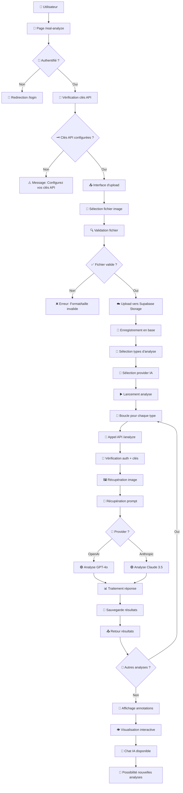
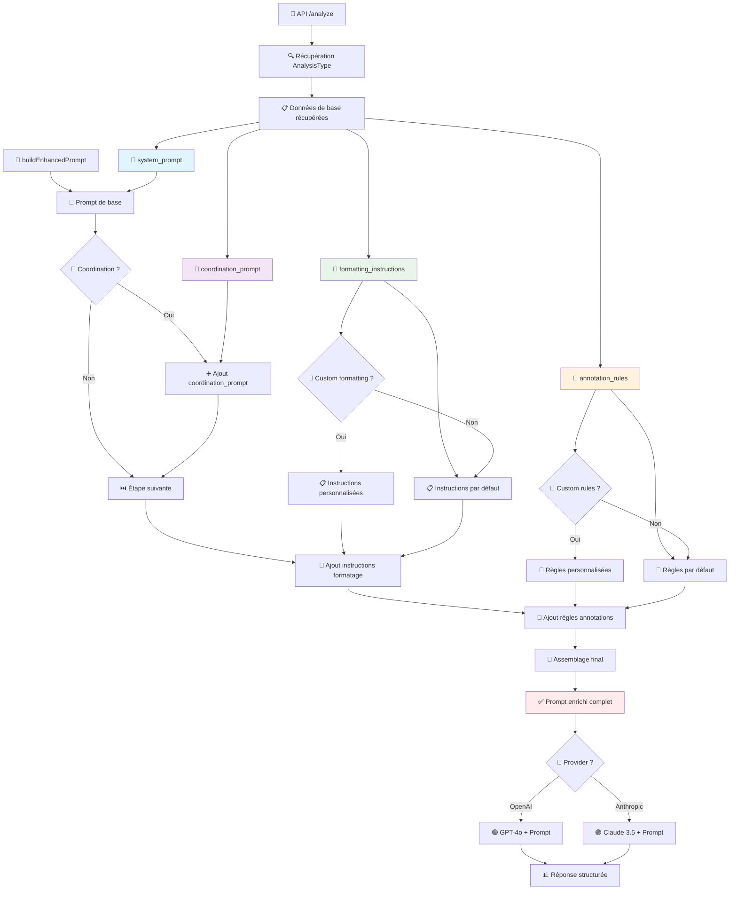

# 🔄 Workflow d'Analyse - Ainalyzer Platform

## 📋 Vue d'ensemble

Ce document décrit le workflow complet d'analyse d'images dans la plateforme Ainalyzer, de l'upload à l'affichage des résultats avec annotations.

## 👁️ Comment Visualiser le Schéma

### **Option 1 : GitHub (Recommandé)**
- Ouvrez ce fichier directement sur **GitHub** dans votre navigateur
- GitHub affiche automatiquement les diagrammes Mermaid
- URL : `https://github.com/agrandjeantech/ainalyzer-platform/blob/master/ANALYSIS_WORKFLOW.md`

### **Option 2 : VSCode avec Extension**
1. Installez l'extension **"Mermaid Preview"** dans VSCode
2. Ouvrez ce fichier `.md` dans VSCode
3. Utilisez `Ctrl+Shift+P` → "Mermaid: Preview"

### **Option 3 : Éditeur Mermaid en Ligne**
1. Copiez le code Mermaid ci-dessous
2. Allez sur **https://mermaid.live/**
3. Collez le code pour voir le diagramme interactif

### **Option 4 : Notion, Obsidian, etc.**
- La plupart des éditeurs Markdown modernes supportent Mermaid
- Copiez-collez ce fichier dans votre éditeur préféré

## 🎯 Schéma du Workflow



## 📊 Détail des Étapes

### 1. 🚪 **Authentification & Vérifications**

```typescript
// Vérification utilisateur
const { data: { user } } = await supabase.auth.getUser()
if (!user) redirect('/login')

// Vérification clés API
const apiKeys = await getApiKeys(user.id)
if (!apiKeys.length) showApiKeyWarning()
```

### 2. 📤 **Upload d'Image**

```typescript
// Validation fichier
const validation = validateImageFile(file)
// Types supportés: JPG, PNG, WebP (max 10MB)

// Upload Supabase Storage
const { data } = await supabase.storage
  .from('analysis-images')
  .upload(filePath, file)

// Enregistrement métadonnées
const imageRecord = await supabase
  .from('images')
  .insert({
    user_id: user.id,
    original_name: file.name,
    storage_path: filePath,
    file_hash: generateHash(file),
    // ...autres métadonnées
  })
```

### 3. 🎯 **Configuration d'Analyse**

```typescript
// Sélection types d'analyse
const selectedTypes = ['accessibility', 'ui-ux', 'technical']

// Sélection provider IA
const selectedProvider = 'anthropic' // ou 'openai'

// Synchronisation entre composants
<AnalysisChat 
  selectedProvider={selectedProvider}
  onProviderChange={setSelectedProvider}
  // ...autres props
/>
```

### 4. 🤖 **Traitement IA**

#### **🧩 Schéma Détaillé - Construction des Prompts**



#### **Route API `/api/analyze`**

```typescript
// Pour chaque type d'analyse sélectionné
for (const analysisTypeId of selectedAnalysisTypes) {
  
  // 1. Récupération du prompt système
  const analysisType = await getAnalysisType(analysisTypeId)
  
  // 2. Construction du prompt enrichi
  const enhancedPrompt = buildEnhancedPrompt(analysisType)
  
  // 3. Appel IA selon le provider
  if (provider === 'openai') {
    result = await analyzeWithOpenAI(apiKey, imageUrl, analysisType)
  } else if (provider === 'anthropic') {
    result = await analyzeWithAnthropic(apiKey, imageUrl, analysisType)
  }
  
  // 4. Sauvegarde résultats
  await supabase.from('analyses').insert({
    user_id: user.id,
    image_id: imageId,
    analysis_type_id: analysisTypeId,
    provider: provider,
    result_json: result,
    status: 'completed'
  })
}
```

#### **🔧 Fonction buildEnhancedPrompt - Détail**

```typescript
function buildEnhancedPrompt(analysisType: AnalysisType) {
  // 1. 📝 Prompt de base (métier)
  let enhancedPrompt = analysisType.system_prompt

  // 2. 🤝 Ajout coordination si disponible
  if (analysisType.coordination_prompt) {
    enhancedPrompt += `\n\nINSTRUCTIONS DE COORDINATION SPÉCIFIQUES:\n${analysisType.coordination_prompt}`
  }

  // 3. 🎨 Instructions de formatage
  const defaultFormatting = "Rôle et fonction : [description] | Position et hiérarchie : [description] | Délimitation visuelle : [description] | Problèmes d'accessibilité : [liste] | Suggestions de code : [code HTML/CSS]"
  const formattingInstructions = analysisType.formatting_instructions || defaultFormatting

  // 4. 📍 Règles d'annotation
  const defaultRules = "Coordonnées précises en pourcentages de l'image. x,y = coin supérieur gauche de la zone."
  const annotationRules = analysisType.annotation_rules || defaultRules

  // 5. 🔗 Assemblage final avec structure technique
  enhancedPrompt += `

INSTRUCTIONS TECHNIQUES POUR LA RÉPONSE:
Votre réponse doit être structurée en deux parties:

1. ANALYSE TEXTUELLE: Suivez exactement les instructions du prompt système ci-dessus.
   STRUCTUREZ votre analyse avec des sections numérotées (1., 2., 3., etc.) pour chaque zone/région identifiée.

2. ANNOTATIONS: Pour chaque section numérotée de votre analyse, créez UNE annotation correspondante:
{
  "annotations": [
    {
      "id": "zone_1",
      "type": "info",
      "title": "Nom de la zone (ex: Navigation Latérale, En-tête, etc.)",
      "description": "STRUCTUREZ le contenu avec ce format exact: ${formattingInstructions}",
      "x": [position X en pourcentage 0-100],
      "y": [position Y en pourcentage 0-100], 
      "width": [largeur en pourcentage],
      "height": [hauteur en pourcentage],
      "color": "#0066cc"
    }
  ]
}

RÈGLES TECHNIQUES CRUCIALES:
${annotationRules}
- Chaque annotation doit reprendre INTÉGRALEMENT le contenu de la section correspondante
- Incluez TOUS les détails selon le format spécifié
- Ne résumez pas, ne raccourcissez pas : copiez TOUT le texte de chaque section

Séparez les deux parties par "---ANNOTATIONS---"`

  return enhancedPrompt
}
```

#### **Analyse OpenAI (GPT-4o)**

```typescript
const response = await openai.chat.completions.create({
  model: "gpt-4o",
  messages: [
    { role: "system", content: enhancedPrompt },
    { 
      role: "user", 
      content: [
        { type: "text", text: "Analysez cette image..." },
        { type: "image_url", image_url: { url: imageUrl } }
      ]
    }
  ],
  max_tokens: 4000,
  temperature: 0.1
})
```

#### **Analyse Anthropic (Claude 3.5)**

```typescript
const response = await anthropic.messages.create({
  model: "claude-3-5-sonnet-latest",
  max_tokens: 4000,
  system: enhancedPrompt,
  messages: [{
    role: "user",
    content: [
      { type: "text", text: "Analysez cette image..." },
      { 
        type: "image", 
        source: { 
          type: "base64", 
          media_type: "image/jpeg",
          data: imageBase64 
        }
      }
    ]
  }]
})
```

### 5. 📊 **Traitement des Résultats**

```typescript
// Parsing de la réponse IA
const parts = fullResponse.split('---ANNOTATIONS---')
const textualAnalysis = parts[0].trim()
const annotationsData = JSON.parse(parts[1].trim())

// Structure des annotations
const annotations = [
  {
    id: "zone_1",
    type: "info", // ou "issue", "recommendation"
    title: "Navigation Latérale",
    description: "Analyse détaillée...",
    x: 10,      // Position X en %
    y: 15,      // Position Y en %
    width: 25,  // Largeur en %
    height: 80, // Hauteur en %
    color: "#0066cc"
  }
  // ...autres annotations
]
```

### 6. 🎨 **Affichage des Résultats**

```typescript
// Composant ImageAnnotationViewer
<ImageAnnotationViewer
  imageFile={uploadedImageFile}
  analysisResults={analysisResults.map(result => ({
    type: analysisType.name,
    issues: annotations.filter(ann => ann.type === 'issue').length,
    recommendations: annotations.filter(ann => ann.type === 'recommendation').length,
    annotations: result.result.annotations,
    summary: result.result.content
  }))}
  isAnalyzing={false}
/>
```

## 🔄 **États du Workflow**

### **États de l'Interface**

1. **`upload`** - Interface d'upload d'image
2. **`configure`** - Sélection types d'analyse + provider
3. **`analyze`** - Analyses en cours
4. **`results`** - Affichage des résultats avec annotations

### **États des Analyses**

1. **`processing`** - Analyse en cours
2. **`completed`** - Analyse terminée avec succès
3. **`error`** - Analyse échouée

## 🗄️ **Base de Données**

### **Tables Principales**

```sql
-- Images uploadées
images: id, user_id, original_name, storage_path, public_url, 
        file_hash, metadata, status, uploaded_at

-- Types d'analyses configurés
analysis_types: id, name, system_prompt, coordination_prompt,
                formatting_instructions, annotation_rules

-- Résultats d'analyses
analyses: id, user_id, image_id, analysis_type_id, provider,
          ai_model, result_json, duration_ms, status, created_at

-- Clés API utilisateurs
api_keys: id, user_id, provider, encrypted_key, active, last_used
```

## 🔧 **Gestion d'Erreurs**

### **Points de Contrôle**

1. **Authentification** → Redirection login
2. **Clés API** → Message configuration
3. **Validation fichier** → Erreur format/taille
4. **Upload Supabase** → Erreur stockage
5. **Appel IA** → Erreur provider/quota
6. **Parsing résultats** → Erreur format réponse

### **Récupération d'Erreurs**

```typescript
try {
  // Analyse IA
  const result = await analyzeWithProvider(...)
} catch (error) {
  // Marquer l'analyse comme échouée
  await supabase.from('analyses').update({
    status: 'error',
    result_json: { error: error.message }
  }).eq('id', analysisId)
  
  // Continuer avec les autres analyses
  continue
}
```

## 🚀 **Performance & Optimisations**

### **Optimisations Implémentées**

1. **Déduplication** - Hash des images pour éviter les doublons
2. **Streaming** - Réponses en temps réel pour les analyses longues
3. **Cache** - Mise en cache des types d'analyses
4. **Compression** - Images optimisées pour l'IA
5. **Parallélisation** - Analyses multiples en séquence

### **Limites Techniques**

- **Vercel Edge Functions** : 30s timeout max
- **OpenAI** : 4000 tokens max par réponse
- **Claude** : 20MB max par image
- **Supabase Storage** : 50MB max par fichier

## 📱 **Interface Utilisateur**

### **Composants Clés**

1. **`real-analyze/page.tsx`** - Page principale
2. **`AnalysisChat`** - Chat IA + sélection provider
3. **`ImageAnnotationViewer`** - Visualisation annotations
4. **`ImageUploader`** - Upload d'images

### **Synchronisation d'État**

```typescript
// État partagé entre composants
const [selectedProvider, setSelectedProvider] = useState('openai')
const [analysisResults, setAnalysisResults] = useState([])
const [isAnalyzing, setIsAnalyzing] = useState(false)

// Props synchronisées
<AnalysisChat 
  selectedProvider={selectedProvider}
  onProviderChange={setSelectedProvider}
  analysisMessages={analysisMessages}
  onStartAnalysis={handleStartAnalyses}
/>
```

## 🎯 **Workflow Complet - Exemple**

1. **Utilisateur** accède à `/real-analyze`
2. **Upload** d'une capture d'écran d'interface web
3. **Sélection** "Analyse d'Accessibilité" + "Claude"
4. **Analyse** → Claude identifie 5 zones avec problèmes d'accessibilité
5. **Résultats** → Annotations visuelles + recommandations détaillées
6. **Chat** → Questions/réponses avec Claude sur les améliorations
7. **Nouvelle analyse** → Possibilité d'analyser la même image différemment

---

*Ce workflow garantit une expérience utilisateur fluide et des analyses IA de haute qualité pour l'accessibilité web.*
